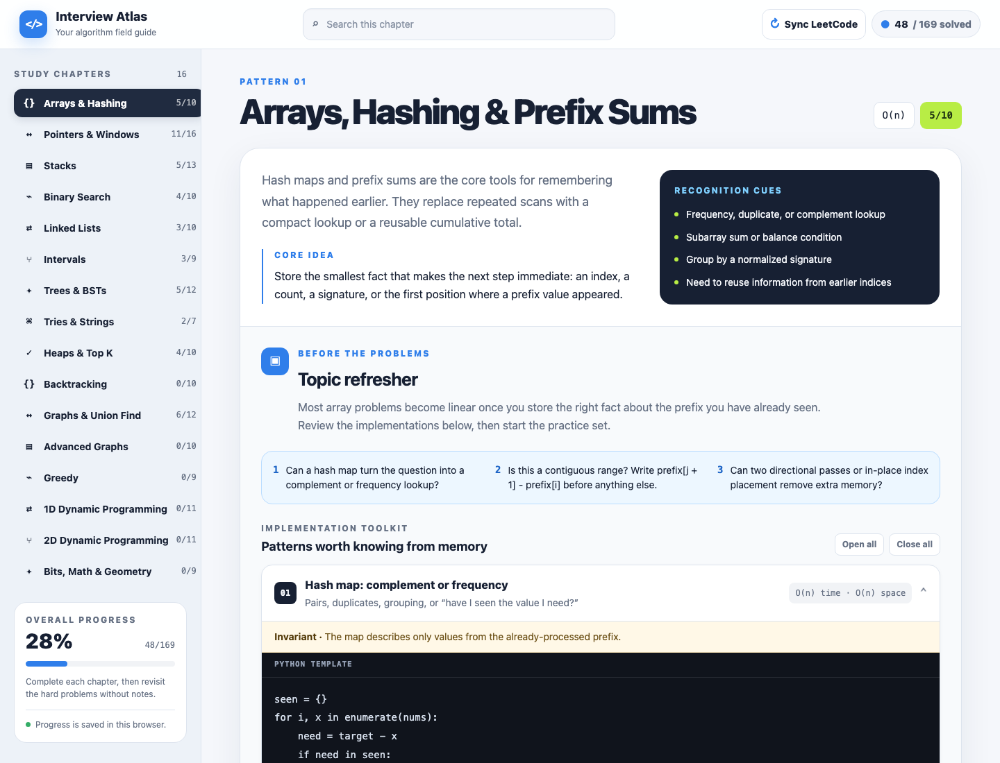
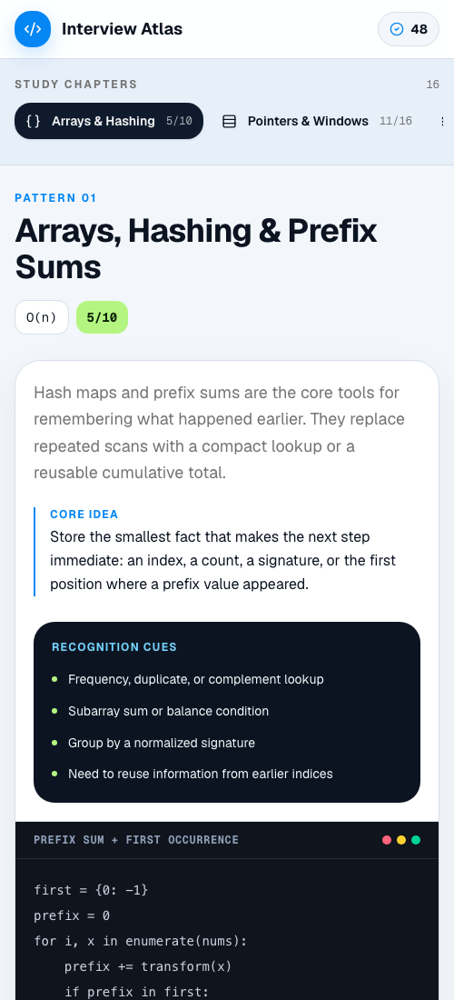

# Interview Atlas

Interview Atlas is an interactive study guide and progress tracker for coding interview preparation. It groups LeetCode problems by reusable algorithmic pattern, pairs them with recognition cues and implementation templates, and saves completion progress between sessions.

## Preview



<p align="center">
  
</p>

## Features

- Pattern-based chapters covering core interview topics
- Pre-problem refreshers with recognition checks, pitfalls, and 65 Python templates
- Curated problems with difficulty labels, notes, and direct LeetCode links
- Search and solved/unsolved filters
- Chapter-level and overall progress tracking
- Persistent progress with Cloudflare D1 in the full app
- Standalone HTML version with progress saved in the browser
- Responsive interface for desktop and mobile

## Tech stack

- React 19 and TypeScript
- [Vinext](https://github.com/cloudflare/vinext) and Vite
- Tailwind CSS and shadcn/ui components
- Cloudflare Workers and D1
- Drizzle ORM and Drizzle Kit
- Plain HTML, CSS, and JavaScript for the standalone version

## Open the standalone HTML version

For the simplest local option, open the project folder and double-click
`interview-atlas.html`. It works directly in your browser—there is no setup,
Node.js, npm command, or local server.

The standalone version includes the same chapters, problem notes, search,
filters, LeetCode links, and progress tracking. Progress is stored locally in
the browser, so it is specific to that browser and computer rather than synced
through the database.

## Run the full app locally

### Prerequisites

- [Node.js](https://nodejs.org/) 22.13 or newer
- npm (included with Node.js)

### Setup

```bash
git clone https://github.com/serhan-cakmak/interview-atlas.git
cd interview-atlas
npm install
npm run db:setup:local
npm run dev
```

Open [http://localhost:3000](http://localhost:3000) in your browser.

The database setup command applies the migrations in `drizzle/` to a local D1 database. Local database files are stored under `.wrangler/` and are ignored by Git.

## Available commands

| Command                  | Description                                    |
| ------------------------ | ---------------------------------------------- |
| `npm run dev`            | Start the development server with hot reload   |
| `npm run build`          | Create a production build                      |
| `npm start`              | Run the production build locally               |
| `npm run lint`           | Check the code with Oxlint                     |
| `npm run format`         | Format the project with Oxfmt                  |
| `npm run db:setup:local` | Apply D1 migrations to the local database      |
| `npm run db:generate`    | Generate a new migration after a schema change |

To test a production build locally:

```bash
npm run build
npm start
```

## Project structure

```text
interview-atlas.html     Standalone version that opens without a server
app/                    Routes, global styles, and API handlers
components/ui/          Shared interface primitives
db/                     Drizzle schema and Cloudflare binding types
drizzle/                SQL migrations and migration metadata
features/progress/      Tracker components, state, and progress syncing
features/study-plan/    Chapters, problems, notes, and code templates
public/                  Static assets
.openai/hosting.json    OpenAI Sites capability configuration
vite.config.ts          Vinext, Vite, and local Cloudflare bindings
wrangler.jsonc          Local D1 migration configuration
```

## Customizing the study plan

Edit `features/study-plan/data.ts` to add or change chapters and problems. Each problem includes its LeetCode ID, title, difficulty, URL slug, study note, and an optional memory cue.

Edit `features/study-plan/reminders.js` to change the pre-problem algorithm
refreshers, then run `npm run standalone:sync` to copy the same reference data
into the standalone HTML file.

If you change the database schema in `db/schema.ts`, generate and review a new migration:

```bash
npm run db:generate
npm run db:setup:local
```

Do not edit migrations that have already been deployed. Add a new migration instead.

## Deployment

The application targets Cloudflare Workers and requires a D1 database bound as `DB`. The included `.openai/hosting.json` also makes the project compatible with OpenAI Sites. When deploying a fork, create your own hosted project and database rather than reusing the placeholder local database ID.

## Contributing

Issues and pull requests are welcome. Before opening a pull request, run:

```bash
npm run lint
npm run build
```

## License

No license has been selected yet. Add a license before inviting others to reuse or redistribute the project.

## Disclaimer

This project is not affiliated with or endorsed by LeetCode. LeetCode is a trademark of its respective owner.
